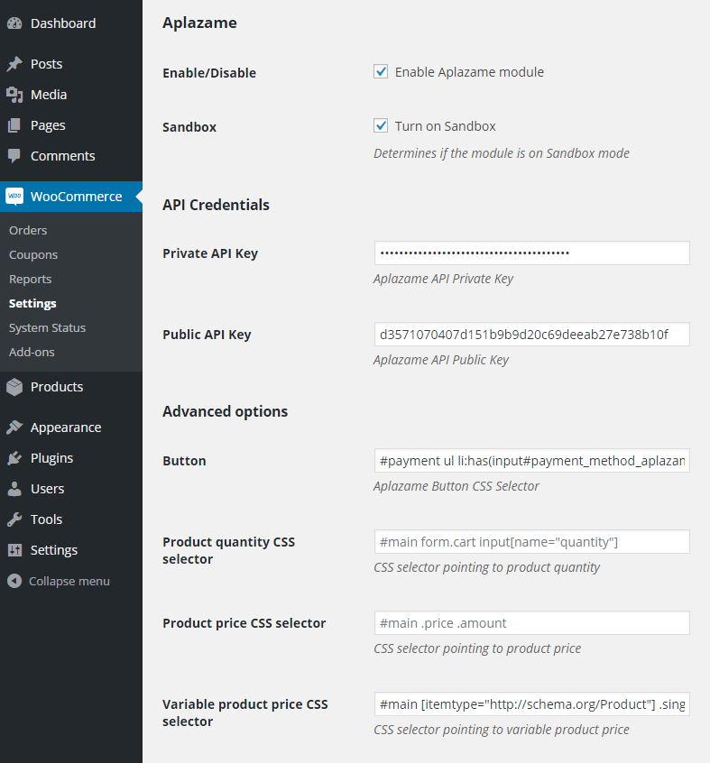

   

### Install

1. **Download** the latest plugin from [here](https://s3.eu-central-1.amazonaws.com/aplazame/modules/woocommerce/wild-style/aplazame.latest.zip) to local directory as `aplazame.latest.zip`.
2. Go to the Wordpress administration page, and then go to **Plugins** > **Add New**.
3. **Add new plugin** and select the `aplazame.latest.zip` file from your computer.

### Usage

* **Sandbox**: Determines if the module is on Sandbox mode.
* **Host**: Aplazame host `https://aplazame.com`
* **API Version**: The latest version is `v1.2`
* **Button**: The CSS Selector for Aplazame payment method. The default selector is `#payment ul li:has(input#payment_method_aplazame)`.
* **Secret API Key**: The Secret Key provided by Aplazame. You cannot share this key with anyone!!
* **Public API Key**: The Public Key provided by Aplazame.
* **Enable Analytics**: If you want to enable customer tracking for better interests.

> Be sure that on all fields you don't keep any whitespace. Otherwise the module can generate unexpected results.

#### Live demo

This is the online demo for uses to test Aplazame and its features.

[http://woo.aplazame.com](http://woo.aplazame.com)

#### Install WooCommerce

It is easy to deploy WooCommerce with [Ansible](http://www.ansible.com/home)!

[https://github.com/aplazame/ansible-wordpress](https://github.com/aplazame/ansible-wordpress)

#### Release history

For new features check [this](HISTORY.md).

#### Help

**Have a question about Aplazame?**

For any support request please drop us an email at [soporte.woo@aplazame.com](mailto:soporte.woo@aplazame.com?subject=Help me with the module).
